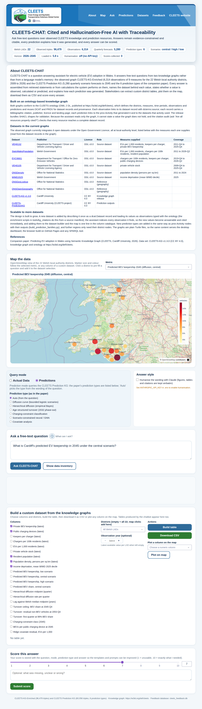

# CLEETS-CHAT: Cited and Hallucination-Free AI with Traceability

Question answering over the CLEETS knowledge graphs of electric-vehicle adoption in Wales. Users ask free-text questions about observed data (private battery-electric vehicle keepership, public charging devices, population, density, income deprivation for the 22 Welsh local authority districts) or about the predictions of the companion paper *Predicting EV adoption in Wales using Semantic Knowledge Graph*. Every answer is composed from retrieved RDF statements or deterministic calculations over the graphs, cites its source datasets, states whether a value is observed, calculated or predicted, and explains how each prediction was generated. Stakeholders can extract custom per-district tables, plot them on an OpenStreetMap view and download them, and score every answer from 1 to 10.

**Live demo (GitHub Pages):** `https://naeima.github.io/cleets-chat/` (after the steps in [Publishing](#publishing-on-github-and-github-pages)). The page runs the same Python question-answering code in the browser, so no server is needed.



<!-- about:start -->
## About CLEETS-CHAT

CLEETS-CHAT is a question-answering assistant for electric-vehicle (EV) adoption in Wales. It answers free-text questions from two knowledge graphs rather than from a language model's memory: the observed graph CLEETS-KG-Enriched (6,314 observations of 9 measures for the 22 Welsh local authority districts, 2009 to 2026) and the CLEETS Prediction KG (5,280 quarterly scenario forecasts to 2045 and the 6 prediction types of the companion paper). Every answer is assembled from retrieved statements or from calculations the system performs on them, names the dataset behind each value, states whether a value is observed, calculated or predicted, and explains how each prediction was generated. Stakeholders can extract custom district tables, plot them on the map, download them as CSV and score every answer.

### Built on an ontology-based knowledge graph

Both graphs conform to the CLEETS ontology (OWL 2 DL, published at https://w3id.org/def/cleets), which defines the districts, measures, time periods, observations and predictions and reuses DCAT and PROV for dataset records and provenance. Each observation links to its dataset record with dcterms:source; each record carries a bibliographic citation, publisher, licence and landing page; each prediction links to the prov:Activity that generated it and to the datasets that activity used. The release bundles SHACL shapes for validation. Because the assistant reads only the graph, it cannot state a value the graph does not hold, and the citation audit (ask "Are all resources properly cited?") checks that every resource reaches a complete dataset record.

### Datasets in the current graphs

The observed graph currently integrates 6 open datasets under the Open Government Licence, all at local-authority level, listed below with the measures each one supplies (read from the dataset records in the graph).

| Dataset | Publisher | Licence | Role | Measures supplied | Coverage |
|---|---|---|---|---|---|
| [VEH0132](https://www.gov.uk/government/statistical-data-sets/vehicle-licensing-statistics-data-tables) | Department for Transport / Driver and Vehicle Licensing Agency | OGL v3.0 | Source dataset | EVs per 1,000 residents, keepers per charger, private BEV keepership | 2011-Q4 to 2025-Q4 |
| [StatsWalesPopulation](https://stats.gov.wales/en-GB/topic/71/people-identity-equality) | Welsh Government | OGL v3.0 | Source dataset | EVs per 1,000 residents, chargers per 100k residents, resident population | 2011 to 2026-Q2 |
| [EVCI9001](https://www.gov.uk/government/collections/electric-vehicle-charging-infrastructure-statistics) | Department for Transport / Office for Zero Emission Vehicles | OGL v3.0 | Source dataset | chargers per 100k residents, keepers per charger, public charging devices | 2019-Q4 to 2026-Q2 |
| [VEH0105](https://www.gov.uk/government/statistical-data-sets/vehicle-licensing-statistics-data-tables) | Department for Transport / Driver and Vehicle Licensing Agency | OGL v3.0 | Source dataset | private vehicle stock | 2009-Q4 to 2025-Q4 |
| [ONSDensity](https://www.ons.gov.uk/peoplepopulationandcommunity/populationandmigration/populationestimates) | Office for National Statistics | OGL v3.0 | Source dataset | population density (persons per sq km) | 2011 to 2024 |
| [WIMD2025](https://www.gov.wales/welsh-index-multiple-deprivation) | Welsh Government | OGL v3.0 | Source dataset | income deprivation (mean WIMD decile) | 2025 |
| [ONSGeoLookup](https://geoportal.statistics.gov.uk/) | Office for National Statistics | OGL v3.0 | Reference (geography) |  |  |
| [ONSOpenGeography](https://geoportal.statistics.gov.uk/) | Office for National Statistics | OGL v3.0 | Reference (geography) |  |  |
| [CLEETS-KG v1.3.0](https://w3id.org/def/cleets) | Cardiff University | CC BY 4.0 | Knowledge graph release |  |  |
| [CLEETS-PredictionKG](https://w3id.org/def/cleets) | Cardiff University (CLEETS project) | CC BY 4.0 | Prediction outputs |  |  |

### Scalable to more datasets

The design is built to grow. A new dataset is added by describing it once as a dcat:Dataset record and loading its values as observations typed with the ontology (the enrichment scripts in tools/kg_citations do this from a source manifest); the assistant indexes every observation it finds, so the new values become answerable and cited immediately, and adding them to the dataset builder and the map is one line in the column catalogue. New prediction types are added in the same way as prov:Activity nodes with their outputs (build_prediction_families.py), and further regions only need their district nodes. The graphs are plain Turtle files, so the same content serves the desktop dashboard, the browser build on GitHub Pages and any SPARQL tool.

### References

Companion paper: Predicting EV adoption in Wales using Semantic Knowledge Graph (CLEETS, Cardiff University, 2026). Data set: CLEETS-KG v1.3.0 (CC BY 4.0), knowledge graph and ontology at https://w3id.org/def/cleets.
<!-- about:end -->

## Contents

- [About CLEETS-CHAT](#about-cleets-chat)
- [What it does](#what-it-does)
- [Prediction types](#prediction-types)
- [Quick start (local)](#quick-start-local)
- [Using the chatbot](#using-the-chatbot)
- [How it was built (reproducibility)](#how-it-was-built-reproducibility)
- [Repository layout](#repository-layout)
- [Tests](#tests)
- [Deployment options](#deployment-options)
- [Publishing on GitHub and GitHub Pages](#publishing-on-github-and-github-pages)
- [Data, licences and citation](#data-licences-and-citation)
- [Limitations](#limitations)

## What it does

| Component | Behaviour |
|---|---|
| Actual Data mode | Retrieves observed statements for a district, a measure, a ranking or a comparison from CLEETS-KG-Enriched and prints them as evidence with the dataset behind each value. |
| Prediction mode | Answers from the Prediction KG: district forecasts by year and scenario, three-scenario comparisons, rankings, milestones, Wales summaries, provenance; routed to the prediction type the question concerns (or forced with the selector). |
| ⓘ How was this predicted? | A panel under every prediction answer describing the method, its assumptions, the source datasets and the paper section and notebook stage that produced it (`methods.py`, values filled from the graph). |
| Custom datasets | "Give me a table of keepership, charging count, deprivation, population and population density for the 22 LADs" (or the builder panel) yields a per-district table with its sources, a CSV download, and a map coloured by any column. |
| Map | OpenStreetMap view of the 22 districts coloured by observed, predicted or custom-dataset metrics; clicking a district pre-fills a question and adds it to the dataset selection. |
| Humanisation (optional) | With `ANTHROPIC_API_KEY` set, the prose of templated answers is reworded by Claude under a constraint prompt; figures, tables and citations are never passed through the model. Off by default. |
| Feedback | Every answer can be scored 1–10 with notes; stored in `cleets_feedback.db` and analysed by `analyze_feedback.py` (the static site keeps scores in the browser and exports them as CSV). |

## Prediction types

The Prediction KG carries one `prov:Activity` per prediction type; every per-district resource links to its activity with `prov:wasGeneratedBy`, so the chatbot can say which model produced a number.

| Type | Paper section | Notebook stage | Loaded from |
|---|---|---|---|
| Bounded logistic diffusion scenarios (low / central / high, quarterly to 2045) | S2.3.6, S3.4.3, S3.5 | Stage 6 | `data/cleets_prediction_kg.ttl` |
| Hierarchical diffusion, two-stage empirical Bayes (midpoint, rate, shrinkage; covariate effects) | S2.3.6, S3.5, Table 9, Figs 4–5 | Stage 11 | `data/cleets_prediction_families.ttl` |
| Age-structured fleet turnover under a 2032 new-sales phase-out (2045/2053 shares, residual non-BEV stock, arrival quarters, Table 10 ceilings) | S2.3.5, S3.6, S3.8 | Stages 7–9 | `data/cleets_prediction_families.ttl` |
| Charging-provision constraint classification for 2045 | research question 2 | Stage 8 | `data/cleets_prediction_families.ttl` |
| Scenario-constrained neural / graph neural forecasts (Tables 5–7 metrics; per-district forecasts to 2030 Q4 when `nn_adoption_ratio_forecast_2030.csv` is supplied) | S2.3.2–S2.3.4, S3.4.1 | Stages 6e, 13, 14 | `data/cleets_prediction_families.ttl` |
| Cross-sectional covariate comparison (Table 8 metrics, Ridge residuals) | S3.4.2 | Stages 4a-bis, 5 | `data/cleets_prediction_families.ttl` |

Details and the question keywords that select each type: [docs/guides/PREDICTION_TYPES.md](docs/guides/PREDICTION_TYPES.md).

## Quick start (local)

Requires Python 3.10 or later.

```bash
git clone https://github.com/Naeima/cleets-chat.git
cd cleets-chat
python -m venv venv
source venv/bin/activate          # Windows: venv\Scripts\activate.bat
pip install -r requirements.txt
python app.py                     # open http://localhost:8050
```

Optional: copy `.env.example` to `.env` and set `ANTHROPIC_API_KEY` to enable humanisation, `PORT` to change the port. The CLEETS logo ships as `assets/cleets_logo.png` (and `docs/assets/cleets_logo.png` for the Pages site) and appears in the header, a banner in the style of the CLEETS Global Center website (site blue, logo left, navigation right, light sweep); without the file the banner draws the CLEETS wordmark. The logo sits in a white card so it shows on the blue (`LOGO_CARD=0` removes the card); `SHOW_WORDMARK=1` shows the wordmark next to the logo. `QUICKSTART.sh` / `QUICKSTART.bat` do the environment steps for you; [docs/guides/COMMAND_PROMPT_SETUP.md](docs/guides/COMMAND_PROMPT_SETUP.md) has the copy-paste commands for Windows, macOS and Linux.

## Using the chatbot

The ⓘ button next to the question box lists example questions per family (observed data, custom datasets, reasoning, provenance and knowledge graph; diffusion scenarios, hierarchical diffusion, turnover, charging constraint, neural forecasts, covariate analysis). Examples:

- `What is Cardiff's predicted EV keepership in 2045 under the central scenario?`
- `Compare Cardiff across all three scenarios in 2045.`
- `When does Powys reach 99% BEV share under the 2032 phase-out?`
- `Which LADs diffuse most slowly?`
- `Where may charging provision be the principal constraint?`
- `How does income deprivation relate to EV adoption?`
- `Give me a table of keepership, charging count, deprivation, population and population density for the 22 LADs.`
- `Which model is most accurate for EV chargers?` (ranks every approach of Table 7 by backtest error, with the Stage 13 logistic run)
- `What do you know about Cardiff?` · `Which LAD has the most public EV chargers?` · `Which dataset supports this answer?` · `Are all resources properly cited?`

Answers end with a **Sources** line built from the graph (dataset landing pages and the CLEETS knowledge graph) and, for predictions, the prediction type and the ⓘ panel. When no statement matches, the system says so rather than inferring. `Are all resources properly cited?` runs `CLEETSKG.citation_audit()`: it checks that every observation, prediction, family resource and activity in the loaded graphs reaches a complete `dcat:Dataset` record (identifier, title, publisher, licence, bibliographic citation, landing page) and prints the citations.

## How it was built (reproducibility)

The system is a chain of artefacts; each step below names the input, the command and the output, so any step can be re-run when a source table is updated.

### 1. Source data

Eight open datasets, all under the Open Government Licence v3 (citations rendered from the dataset records in the graph):

| Record | Dataset | Publisher |
|---|---|---|
| VEH0132 | Licensed ultra low emission vehicles by fuel type, keepership and local authority (private battery-electric extract) | DfT / DVLA |
| VEH0105 | Licensed vehicles by body type, fuel type, keepership and local authority (private stock, all body types) | DfT / DVLA |
| EVCI9001 | Public EV charging devices, United Kingdom (historic table, quarterly) | DfT / OZEV |
| StatsWalesPopulation | Population estimates by local authority and year (mid-year estimates) | Welsh Government |
| ONSDensity | Population density (persons per square kilometre), England and Wales | ONS |
| WIMD2025 | Welsh Index of Multiple Deprivation, income domain deciles by LSOA | Welsh Government |
| ONSGeoLookup, ONSOpenGeography | LSOA to local authority lookup; statistical geography codes and names | ONS |

### 2. Ontology and observed knowledge graph

- The CLEETS ontology (OWL 2 DL, published at https://w3id.org/def/cleets) defines districts, observations, measures, time entities and provenance terms; the release graph declares `dcterms:conformsTo` it and bundles the SHACL shapes used for validation.
- `notebooks/Final_Modelling_CLEETS_all_body_types_private_keepership.ipynb`, Stages 1–3 and 12, builds the ontology, populates CLEETS-KG from the source tables, adds the commonsense (CSKG) alignment layer and writes the release graph `cleets_kg_v130.ttl` (87,824 triples).
- `tools/kg_citations/enrich_citations.py` adds the citation layer (`dcterms:source` from every observation to its `dcat:Dataset` record, rendered `dcterms:bibliographicCitation`, licence, publisher and landing page per dataset, `prov:wasGeneratedBy` activities for derived indicators) from a source manifest `cleets_sources.json`, and `tools/kg_citations/validate.py` re-checks the result with SHACL and a SPARQL coverage audit. Output: `data/cleets_cskg_enriched.ttl` (CLEETS-KG-Enriched v1.3.0, 96,479 triples: 22 Welsh LADs with 6,314 observations over nine measures, 296 English LADs with population density, 8 dataset records).

### 3. Models and the Prediction KG

All modelling is in the companion notebook `notebooks/CLEETS_EV_Adoption_Wales_Quarterly.ipynb` (the 2026-09 quarterly revision of `Final_Modelling_CLEETS_all_body_types_private_keepership.ipynb`, which is kept alongside it); every table and figure of the paper is produced by a numbered stage, and the final cell is a paper parity check that lists each quantity the manuscript states against the value the run produced.

- Stage 6 fits the matched-scope bounded logistic diffusion curves (private BEVs over private licensed vehicles, all body types) and Stage 15 exports `data/cleets_prediction_kg.ttl`: 5,280 LAD-quarter forecasts (22 districts, 2026 Q1 to 2045 Q4, three scenarios) plus Wales totals and 198 milestone predictions, the scenario nodes (terminal target share 95 / 99 / 99.9 % at 2045 Q4 with the fitted midpoint shift) and the generating activity `diffusion-q2026rev`. Both notebook versions export the identical graph (57,612 triples).
- Stages 4a-bis and 5 (covariates and cross-sectional comparison), 7–9 (2032 phase-out and age-structured turnover to 2053), 11 (hierarchical diffusion), 13–14 (rolling-origin quarterly backtest of the bounded logistic off the released KG, and of the NN, scenario-constrained NN, GNN, scenario-constrained GNN and persistence-plus-drift baseline on identical folds: held-out quarters 2022 Q1 to 2025 Q4, at least eight training quarters per district, 352 LAD-quarters per configuration, capacity K = α × the last training observation with α = 6 / 10 / 15) produce the other prediction types and the accuracy tables. They are added to the graph with

  ```bash
  python build_prediction_families.py --notebook notebooks/CLEETS_EV_Adoption_Wales_Quarterly.ipynb --output data/cleets_prediction_families.ttl
  # with the notebook's CSV exports (full quarterly series, Stage 6e per-district forecasts):
  python build_prediction_families.py --csv-dir cleets_out --notebook notebooks/CLEETS_EV_Adoption_Wales_Quarterly.ipynb --output data/cleets_prediction_families.ttl
  ```

  which writes one `prov:Activity` per type (label, method comment, paper section, notebook stage, bibliographic citation, `prov:used` datasets), typed per-district resources (`cleets:DiffusionParameterEstimate`, `cleets:ElectrificationArrival`, `cleets:AdoptionMilestonePrediction`, `cleets:ChargingConstraintAssessment`, `cleets:CovariateResidual`, `cleets:ModelMetric` with MAE, RMSE, mean per-district R², pooled R² and the number of held-out predictions), each with `prov:wasGeneratedBy` and `dcterms:source` links, and completes the citation records of the released Prediction KG (its own dataset record, the diffusion activity's citation, the scenario nodes' provenance) without editing that file. Re-run after every notebook run: the dashboard shows the values of the run you supply.
- Accuracy, from Table 7 of the quarterly run (lowest one-step-ahead MAE first): public charging devices, persistence + drift 9.34, scenario-constrained NN 9.78 (lowest RMSE, 15.11), bounded logistic 12.59, scenario-constrained GNN 17.22, GNN 25.28, NN 40.53; private BEV keepership, persistence + drift 17.88, bounded logistic 25.15, scenario-constrained NN 35.99, scenario-constrained GNN 113.2, GNN 196.4, NN 267.6. Drift and the networks track the next quarter best but cannot carry a scenario or saturate, so the bounded logistic remains the instrument behind the 2045 scenarios; the notebook produces no charger forecast to 2045 (charging enters the 2045 outlook through the Stage 8 constraint assessment).
- Two supplementary notebooks are included and run end to end: `notebooks/cleets_quarterly_forecast_corrected_accuracy.ipynb` (quarterly walk-forward comparison of naive, log-trend and vehicle-stock-bounded logistic models with a hybrid forecast to 2045) and `notebooks/cleets_monthly_quarterly_ev_charger_forecasting_pipeline.ipynb` (monthly and quarterly charger forecasting, bounded logistic, MLP and GCN backtests, publication maps).

### 4. Question answering

- `kg_service.py` loads the graphs with rdflib and builds in-memory indexes once (districts and aliases, periods, observations per district, predictions per district and scenario, prediction families, dataset records). Every value the chatbot prints is read from these indexes; nothing is estimated at query time.
- `qa_with_humanization.py` (imported as `qa`) turns a question into an answer with rules, not a language model: district names by alias matching, years and scenarios by pattern, prediction type by keyword routing, measures by vocabulary, and fixed Markdown templates per question family; `table_answer()` builds the custom datasets. `methods.py` holds the ⓘ texts, written from the notebook stages and filled with the scenario constraints, coefficients, ceilings and metrics stored in the graph; `about.py` holds the About text and reads the dataset catalogue (`CLEETSKG.dataset_catalogue()`) from the graph, so a newly added dataset is listed automatically.
- `app.py` is the Dash interface; `evaluate_answers.py` runs a benchmark of question templates against SPARQL gold answers; `analyze_feedback.py` summarises the stakeholder scores.

### 5. Static site for GitHub Pages

GitHub Pages serves static files only, so `build_site.py` exports the indexes to `docs/data/kg_snapshot.json` and copies the Python modules to `docs/py/`; `docs/index.html` loads them in the browser through Pyodide, and `tests/test_snapshot.py` checks that the snapshot gives the same answers as the rdflib-backed service.

```bash
python build_site.py     # rebuild docs/ after changing the graphs or the Python modules
```

## Repository layout

```
app.py                         Dash dashboard (map, chatbot, ⓘ panels, dataset builder, scoring)
kg_service.py                  rdflib access layer, indexes, prediction families, dataset extraction, JSON snapshot
qa.py / qa_with_humanization.py  deterministic question answering; optional Claude rewording
methods.py                     "how was this predicted" texts per prediction type
about.py                       "About CLEETS-CHAT" text; datasets and figures filled from the graph (also refreshes the README block)
build_prediction_families.py   notebook outputs / CSV exports -> data/cleets_prediction_families.ttl
build_site.py                  -> docs/ (GitHub Pages build)
analyze_feedback.py, evaluate_answers.py
data/                          cleets_cskg_enriched.ttl, cleets_prediction_kg.ttl, cleets_prediction_families.ttl
docs/                          GitHub Pages site (index.html, app.js, style.css, data/, py/) and guides/
notebooks/                     companion modelling notebook (quarterly revision + original) and two supplementary pipelines
tools/kg_citations/            citation-layer enrichment and validation for the knowledge graph
tests/                         pytest smoke tests and snapshot round-trip
assets/                        cleets_logo.png (header logo)
```

## Tests

```bash
pip install -r requirements-dev.txt
pytest -q
```

The tests load the graphs, answer every example question in the help panel, build a dataset, check the ⓘ panels, check the Table 7 ranking and the citation audit (every resource reaches a complete dataset record), and verify that the GitHub Pages snapshot answers identically. `.github/workflows/ci.yml` runs them on every push.

## Deployment options

- **Local**: `python app.py` (see Quick start).
- **Docker**: `docker build -t cleets-chat . && docker run -p 8050:8050 cleets-chat` (add `-e ANTHROPIC_API_KEY=...` for humanisation).
- **Gunicorn / PaaS**: `Procfile` runs `gunicorn app:server`; works on Render, Railway, Heroku and similar.
- **GitHub Pages** (no server, all features except humanisation and the shared feedback database): see below.

## Publishing on GitHub and GitHub Pages

1. Create an empty repository on GitHub named `cleets-chat` (no README, licence or .gitignore; they are here).
2. From this folder:

   ```bash
   git init -b main
   git add .
   git commit -m "CLEETS-CHAT: cited question answering over the CLEETS knowledge graphs"
   git remote add origin https://github.com/Naeima/cleets-chat.git
   git push -u origin main
   ```

3. On GitHub: **Settings → Pages → Build and deployment → Source: Deploy from a branch → Branch: main, folder: /docs → Save.** The site is live at `https://naeima.github.io/cleets-chat/` after a minute or two.
4. Put the link in this README (top) and in the repository description. Add `assets/cleets_logo.png` and `docs/assets/cleets_logo.png` for the logo.

Whenever the graphs or the Python modules change: `python build_site.py`, run the tests, commit `docs/` with the code.

## Data, licences and citation

- Code: MIT License (see `LICENSE`).
- Knowledge graphs (`data/*.ttl`): CC BY 4.0, as declared in their dataset records. Cite the release graph as:

  > Hamed, N., Yao, F., Potoglou, D., Haggar, P., Sharma, A., Wadhwa, A. & Rana, O. (2026) CLEETS-KG v1.3.0: knowledge graph of electric-vehicle adoption and charging provision across Welsh local authority districts [Data set]. Zenodo. (DOI to be minted on deposit.)

- Source statistics: DfT/DVLA VEH0132 and VEH0105, DfT/OZEV EVCI9001, Welsh Government StatsWales population estimates and WIMD 2025, ONS population density and geography lookups, all under the Open Government Licence v3; full citations and landing pages are stored in the graph and printed by the chatbot.
- Software citation: see `CITATION.cff`.

CLEETS is funded under an NSF–UKRI Global Centre (NSF award 2330565, UKRI grant EP/Y026233/1).

## Limitations

- The question-answering path is rule- and template-based: it answers the families listed in the help panel and declines the rest; it does not generate text. Optional humanisation uses a language model for wording only.
- Predictions are model outputs under stated assumptions (the 2045 terminal shares, the 2032 phase-out, the scrappage curve); the chatbot labels them as such. Values reflect the notebook run that produced the graphs; the notebook's paper parity check lists where a run differs from the manuscript.
- Retrieval in Actual Data mode is keyword-based over the indexed measures; unusual phrasings may need the wording of the help panel.
- The GitHub Pages build loads a 6 MB snapshot and a Python runtime on first visit; scores entered there stay in the visitor's browser.

## Contact

Naeima Hamed, Cardiff University: naeima.hamed@gmail.com. Issues and pull requests are welcome.
